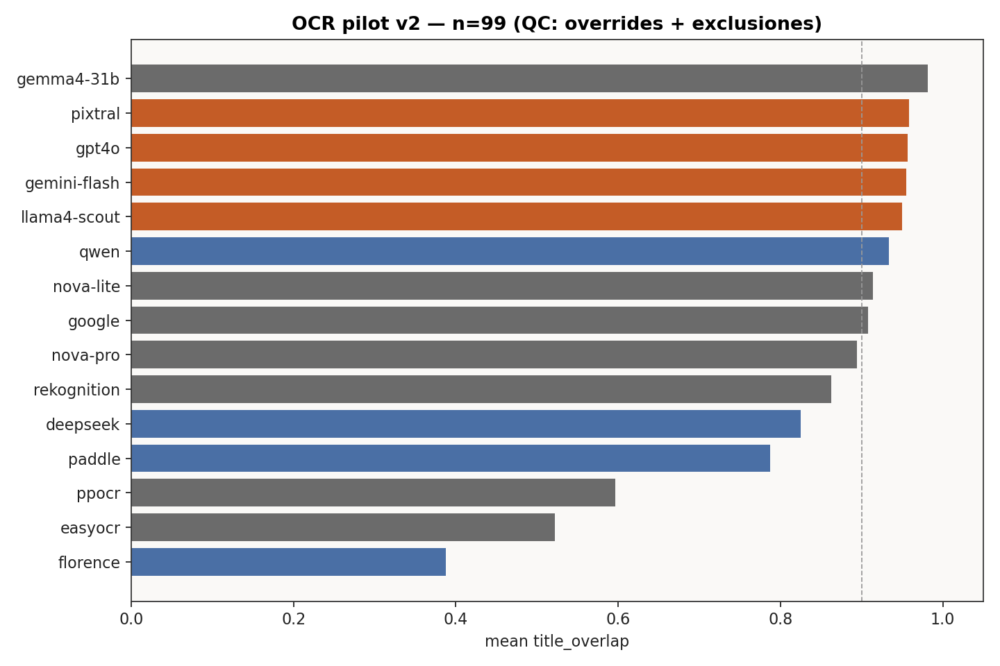
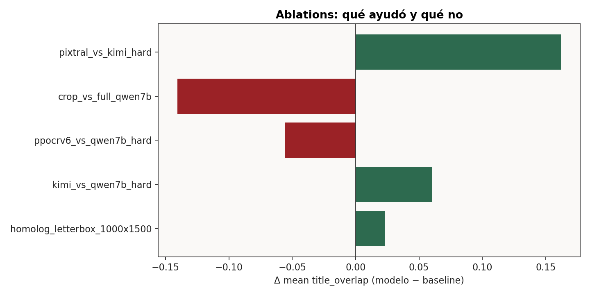
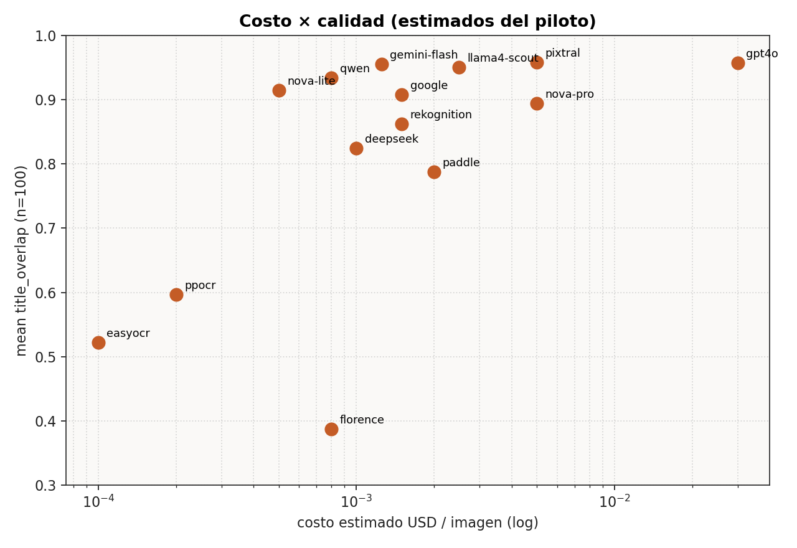
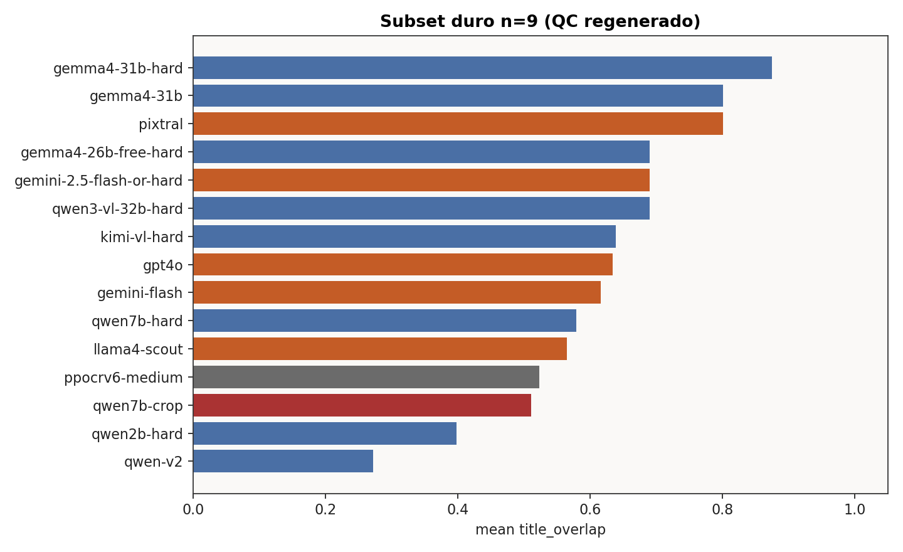

# Cómo leer el título en un póster de terror: viaje OCR hasta el mejor camino

**Proyecto:** What Fear Looks Like / Cómo se ve el miedo  
**Meta:** máxima calidad de lectura del **título** TMDB (`title_overlap`; costo secundario).  
**Fecha de cierre del benchmark:** 31 jul 2026 (QC hard set)  
**Artefactos numéricos:** [`pipeline/data/qa/ocr_article/`](../pipeline/data/qa/ocr_article/) · regenerar con `python3 pipeline/rebuild_ocr_hard_set.py --also-article`

---

## 1. El problema

Los pósters de horror meten tipografía distorsionada, letras pegadas, sangre sobre el título y créditos que compiten visualmente. Un OCR “de documentos” falla donde un humano aún lee el título.

**Métrica principal:** `title_overlap` — solapamiento de tokens entre el título de catálogo (TMDB) y el texto OCR (casefold). No es CER: premia recuperar el título, no transcribir todo el póster. Limitación: tokens pegados (`8BUTTERFLIES`) puntúan 0 aunque las letras “estén”.

**No optimizamos** aquí layout completo ni créditos fieles (los VLM cloud a veces alucinan elenco).

---

## 2. Datos

| Set | n | Cómo se construyó |
|-----|---|-------------------|
| **Pilot v2** | 99* | Estratificado década × `text_area`, seed 42 → `ocr_pilot_v2/` |
| **Hard** | **9** | Histórico hard12 (Qwen2-VL-2B `title_overlap < 1`) − QC 2026-07-31 |
| **Homolog A/B** | 35 | Intersección pilot ∩ `posters_homolog` (1000×1500) |

\*Tras QC: se excluye `1015482` (póster DE). Overrides de título: `77399`→*Blood Suckers*, `940187`→*INQUISITION* (`ocr_qa_title_overrides.csv` / `ocr_qa_exclude_ids.csv`).

Corpus QA filtrado de fondo: **14 384** ids (`corpus_filter_qa_ids.csv`). Este artículo no escala OCR a los 14k; solo fija el **camino** y el costo orden-de-magnitud.

### QC del hard set (31 jul 2026)

| id | Acción | Motivo |
|----|--------|--------|
| 77399 | fuera del hard (score→1) | Título catálogo era aka *Incense…*; TMDB/póster = *Blood Suckers* |
| 940187 | fuera del hard (score→1) | Typo TMDB `INQUISTION` + `THE` ausente en póster |
| 1015482 | excluido | Póster en alemán (`Todeskuss der Schlange`) |
| resto | hard9 | Tipografía real / título simbólico |

Regenerar: `python3 rebuild_ocr_hard_set.py --also-article`

---

## 3. Baselines clásicos (n=99)

Detect+recognize / APIs de texto en imagen.

| Modelo | mean overlap | title_hit |
|--------|-------------:|----------:|
| Google Vision | 0.908 | 0.85 |

Sirven de piso barato. En tipografía artística (p. ej. *8 Butterflies*) suelen dejar el título pegado → overlap 0.



---

## 4. VLM open source (n=99 y hard9)

En GPU (`g4dn` / luego `g5` para Kimi) + OpenRouter:

| Modelo | Contexto | mean overlap |
|--------|----------|-------------:|
| **Gemma 4 31B** (OpenRouter) | n=99 | **0.982** |
| Qwen2-VL-2B (`qwen` v2) | n=99 | 0.934 |
| **Gemma 4 31B** hard | hard9 | **0.875** (run dedicado) / 0.801 (slice n=99) |
| Kimi-VL-A3B 4bit hard | hard9 | 0.639 |
| Qwen2-VL-7B 4bit hard | hard9 | 0.579 |

El subset **hard** es donde se ve progreso real; tras QC, Gemma 31B lidera OSS y el techo amplio.

---

## 5. Ablations de imagen (qué no fue la palanca)



| Ablation | n | Veredicto |
|----------|--:|-----------|
| Homolog 1000×1500 vs w342 (Qwen) | 35 | Leve; mediana ya en techo |
| Crop Surya → Qwen vs full | 9 | Empeora |

**Lección:** recortar “zonas de texto” a ciegas quita contexto que el VLM usa para desambiguar título vs tagline.

---

## 6. OSS en el subset duro (hard9)

| Modelo | mean hard9 |
|--------|------------:|
| **Gemma 4 31B** (`gemma4-31b-hard`) | **0.875** |
| Gemma 4 31B (slice v2) | 0.801 |
| Kimi-VL-A3B | 0.639 |
| Qwen2-VL-7B 4bit | 0.579 |
| PP-OCRv6 medium (CPU) | 0.523 |

---

## 7. Cloud: techo en n=99 y en hard9

### 7.1 Sample amplio (n=99, QC)

| # | Modelo | mean n=99 | latencia media |
|--:|--------|----------:|---------------:|
| 1 | **Gemma 4 31B** | **0.982** | ~3.1 s |
| 2 | Pixtral (Bedrock) | 0.958 | ~29 s |
| 3 | GPT-4o | 0.957 | ~1.5 s |
| 4 | Gemini 2.5 Flash | 0.955 | ~2.5 s |
| 5 | Llama 4 Scout | 0.950 | ~0.8 s |



### 7.2 Hard9 (QC)



| # | Modelo | mean hard9 |
|--:|--------|------------:|
| 1 | **Gemma 4 31B** (OpenRouter hard run) | **0.875** |
| 2 | Pixtral / Gemma 31B (slice v2) | **0.801** |
| 3 | Qwen3-VL-32B / Gemini 2.5 Flash OR / Gemma 26B free | 0.690 |
| 4 | Google Vision | 0.662 |
| 5 | Kimi-VL | 0.639 |
| 6 | GPT-4o | 0.634 |
| 7 | Gemini Flash (piloto) | 0.616 |

---

## 8. Veredicto: mejor camino de calidad

Archivo machine-readable: [`pipeline/data/qa/ocr_article/winner.json`](../pipeline/data/qa/ocr_article/winner.json)

| Campo | Valor |
|-------|--------|
| **Primary (overall hard9)** | **Gemma 4 31B** (OpenRouter) |
| **Primary cloud (Bedrock/piloto)** | **Pixtral Large** |
| Mean hard9 | Gemma **0.875** · Pixtral **0.801** |
| Mean n=99 | Gemma **0.982** · Pixtral **0.958** |
| **Receta** | Póster **full-frame**, **sin crop**, prompt de extracción de texto visible |
| Mejor OSS self-host (hard) | Kimi-VL-A3B 4bit (si no OpenRouter) |
| No hacer | Crop agresivo · PP-OCRv6 como primary · Homolog como palanca · Evaluar pósters no-EN |

### Por qué cambia el cierre

Tras QC del hard set (títulos aka/typos y póster DE), el ranking se reordena: **Gemma 4 31B** pasa al frente en hard9 y en n=99. Pixtral sigue siendo el mejor del paquete cloud Bedrock del piloto original.

### Estimación orden-de-magnitud (~14–18k pósters)

| Opción | ≈ costo |
|--------|---------|
| Gemini Flash | ~$9–36 |
| GPT-4o | ~$25 (medido ~$0.14/100) |
| Gemma 4 31B (OpenRouter) | bajo–medio $/img |
| Pixtral | bajo $/img estimado, **alto wall-clock** |
| Kimi / Qwen self-host | GPU-horas (g5/g4dn) |

---

## 9. Ejemplo paso a paso (tipografía pegada)

**Id 233194 — *8 Butterflies*** (ver también `ocr_pilot_v2/medium_examples/`)

| Familia | Comportamiento típico | Overlap |
|---------|----------------------|--------:|
| Google / Rekognition / EasyOCR / Qwen 2B | `8BUTTERFLIES` pegado | 0 |
| GPT-4o / Gemini / Pixtral / Gemma | `8 BUTTERFLIES` | 1 |

El salto de calidad no fue “más resolución del póster”; fue **un VLM que segmenta el título** donde el OCR clásico no inserta espacios.

Caveat: cloud puede inventar créditos; la métrica de este artículo es **título**, no transcript forense.

---

## 10. Reproducibilidad

### Regenerar hard QC + tablas y figuras

```bash
cd pipeline
python3 rebuild_ocr_hard_set.py --also-article
# o solo figuras/tablas:
MPLBACKEND=Agg python3 build_ocr_article_benchmark.py
# → data/qa/ocr_article/{ladder_n100,ladder_hard12,ablations}.csv
# → data/qa/ocr_article/figures/*.png
# → data/qa/ocr_article/winner.json
# → data/qa/ocr_qwen_hard/sample_ids.txt (hard9)
```

### Prefijos S3 (bucket `aof-owlv2-102516364259`)

| Prefijo | Qué |
|---------|-----|
| `ocr_pilot_v2/` | Benchmark n=100 + results |
| `ocr_qwen_homolog/` | Qwen sobre homolog (n=35) |
| `ocr_qwen_hard/` | Qwen 2B/7B hard (ahora n=9) |
| `ocr_qwen_hard_crop/` | Crop + Qwen (ablation negativa) |
| `ocr_ppocrv6_hard/` | PP-OCRv6 medium hard |
| `ocr_kimi_hard/` | Kimi-VL hard |
| `posters_homolog/` | Letterbox 1000×1500 |

### Scripts de piloto (referencia)

- Cloud: `pilot_ocr_bedrock.py`, `pilot_ocr_openai.py`, `pilot_ocr_gemini.py`
- OpenRouter: `pilot_ocr_openrouter.py`
- Self-host: `pilot_ocr_models.py`
- Hard QC: `rebuild_ocr_hard_set.py`
- AWS hard/Kimi: `aws/launch_ocr_kimi_hard.sh`, `aws/pull_ocr_kimi_hard.sh`, etc.

---

## 11. Qué sigue (fuera de este cierre)

1. Roll-out Gemma 31B / Pixtral (o Gemini si priorizas $/latencia) al corpus QA **14 384**.
2. Postproceso opcional: alinear OCR a `title_boxes_rekognition` solo como **verificación**, no como crop de entrada.
3. Ampliar filtro EN a **idioma del póster** (no solo `original_language` de la película).

---

*Resumen técnico paralelo:* [`RESUMEN_OCR_POSTERS.md`](RESUMEN_OCR_POSTERS.md)
